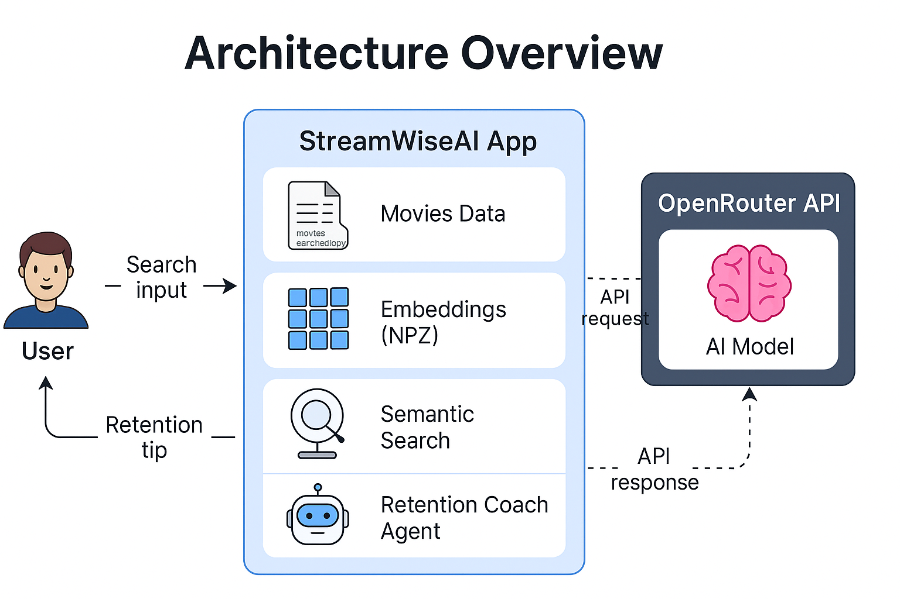

# 🎬 StreamWiseAI — Personalized Movie Recommender & Retention Coach

[](https://streamlit.io)  
[](https://www.sbert.net)  
[](https://huggingface.co/spaces/rajesh1804/StreamWiseAI)  
[](https://opensource.org/licenses/MIT)

> 🎯 **StreamWiseAI** is a smart movie recommendation engine that combines semantic search with an AI-powered Retention Coach. Built to mimic the intelligence of Netflix-style recommender pipelines — but fully local, transparent, and recruiter-grade.

🔗 **Live Demo**: [Try on Hugging Face Spaces](https://huggingface.co/spaces/rajesh1804/streamwiseai)  
📄 **Medium Article**: _Coming soon_  
📌 **Built by**: [Rajesh Marudhachalam](https://www.linkedin.com/in/rajesh1804/)

---

## 🧠 What It Solves

_"What should I watch next… and why will I like it?"_

Streaming platforms have endless content, but not enough **contextual guidance**.  
StreamWiseAI solves this with:

- 🎯 Semantic search based on movie themes + overviews  
- 🧠 Personalized tips from an **AI Retention Coach Agent**  
- 🕵️ Session-aware user history to make better future suggestions

> ✅ Makes your recommender not just smart — but **explainable**.

---

## 🔧 Features

✅ **Semantic Movie Recommender** using Sentence-BERT  
🧠 **AI Retention Coach Agent** via OpenRouter LLM API  
🎯 **Fuzzy Title Matching** for typo-tolerant search  
👀 **Session-aware Viewing History** to personalize experience  
🖼️ **Dynamic Poster & Overview UI** with genre highlights  
🧰 **Deployable on Hugging Face Spaces** (free-tier compatible)  
💬 **Natural Language Tips** for continued user engagement  
⚙️ **Modular Codebase** for ML, UI, and agent separation

---

## 🖼️ Architecture Overview

<p align="center">
  
</p>

```text
📂 Raw Data Sources
├── 📄 MovieLens Ratings + Titles (CSV)
└── 📄 TMDb Metadata (Genres, Posters, Overview)

⬇️ Data Enrichment Pipeline (Fuzzy Matching + Merging)
├── ✅ Title Normalization
├── 🧩 FuzzyWuzzy Matching with Year Filter
├── 🔄 Genre Merge (MovieLens + TMDb)
└── 📦 Output: movies_enriched.csv

⬇️ Embedding Generation
├── 🔤 Input Text = "Title + Genres + Overview"
├── 🧠 Model: all-MiniLM-L6-v2 (Sentence-BERT)
└── 💾 Output: movie_embeddings.npz (SBERT vectors)

⬇️ Recommender Engine (scripts/recommender.py)
├── 🔍 Fuzzy Match Input Title
├── 📈 Cosine Similarity with Embedding Store
└── 🎯 Top K Semantic Neighbors (Vector Search)

⬇️ LLM Agent (agent.py)
├── 🤖 Prompt Built from Input + Rec Results
├── 📬 LLM: Mistral-7B via OpenRouter (Free)
└── 🧠 Output: Personalized Retention Tip

⬇️ Streamlit UI (app.py)
├── 🧠 Input Box with Session Watch History
├── 🎬 Recommendations with Posters, Genres, Overview
├── 💡 LLM Insight Box with Retry Logic
└── 🚀 Deployed on Hugging Face Spaces
```

---

## 💡 Retention Coach Agent

> ✨ An AI “Content Coach” that explains why you’ll enjoy a movie — like Netflix’s internal behavior models.

The **Retention Coach Agent** reads the user’s selected movie and top 5 recommendations, then produces:

- A 1–2 line content insight (e.g., “You enjoy nostalgic animated journeys about friendship.”)
- A contextual tip to keep users engaged

Powered by [OpenRouter](https://openrouter.ai) + [Mistral-7B-Instruct](https://huggingface.co/mistralai/Mistral-7B-Instruct).

---

## 🧪 Example Flow

1. User searches: `"batman"`  
2. App fuzzy-matches and embeds input query  
3. App recommends:
   - 🎥 Similar animated or nostalgic titles  
   - 🎭 Semantic match based on overview and genre
4. 💡 Retention coach suggests:  
   _"You seem to enjoy dark, vigilante-style thrillers. You may also love intense detective mysteries or neo-noir stories!"_  
5. 📖 User’s search history is visible under a collapsible list
---

## 📽️ Live Demo

🚀 **Highlights**  
- Vector Search + Fuzzy Matching for smart retrieval  
- OpenRouter LLM Agent for content insights  
- Streamlit UI with dynamic posters, search memory, retry logic  
- Production-ready, deployed on Hugging Face (free-tier)

👉 Try it on [Hugging Face Spaces](https://huggingface.co/spaces/rajesh1804/StreamWiseAI)

<p align="center">
  
</p>

---

## 📊 Evaluation & Observability

- Cosine similarity is printed in the sidebar for each match
- LLM latency and retries are handled gracefully
- Embedding search latency ~150ms locally

> ✅ Future versions can log latency and similarity per session

---

## 🧠 How It Works – Under the Hood of StreamWiseAI

StreamWiseAI blends NLP and AI agents to simulate the intelligence behind modern streaming platforms.

### 🎯 1. Semantic Movie Matching

We use Sentence-BERT embeddings trained on movie overviews + genre metadata to create rich vector representations.

- Title search is fuzzy-matched
- Query is encoded dynamically
- Cosine similarity is used to find nearest movies

> ✅ Why it matters: Simulates how streaming platforms serve similar content even with vague input.

### 🧠 2. AI Agent Retention Coach

Once recommendations are shown, an OpenRouter LLM (e.g. Mistral) analyzes the results and suggests a short retention insight.

> ✅ Why it matters: Simulates Netflix’s behavior analysis and proactive engagement.

### 🗃️ 3. Session-aware Search History

Each user session stores past movie searches, optionally used to inform recommendations and insights.

> ✅ Why it matters: Demonstrates personalization + memory.

---

## 🚀 Getting Started Locally

### 1. Clone the repo
```bash
git clone https://github.com/rajesh1804/StreamWiseAI.git
cd StreamWiseAI
```
### 2. Setup Python 3.10 (Recommended)

### 3. Install Dependencies
```bash
pip install -r requirements.txt
```
You’ll need:

- requests==2.31.0
- sentence-transformers==2.2.2
- streamlit==1.33.0
- tenacity
- python-dotenv

### 4. Add `.env` file
Create a `.env` file with:

```ini
OPENROUTER_API_KEY=your_api_key_here
```

### 5. Run App
```bash
streamlit run app.py
```

---

## 🧠 Why This Project Matters

Modern recommender systems go beyond just content — they understand context, preferences, and attention. StreamWiseAI is designed to simulate this *product intelligence* by combining:

- 🧠 **NLP + Semantic Vectors** for real-time similarity search  
- 🤖 **LLM Agents** that summarize user preferences  
- 💡 **Personalized UI experience** powered by session memory

> 🎯 It’s not just about building a recommender — it’s about building a **smart product**.

---

## 🛠️ Tech Stack

| Layer            | Technology |
|------------------|------------|
| UI               | Streamlit |
| Embeddings       | sentence-transformers (MiniLM-L6-v2) |
| Vector Search    | Cosine Similarity via `util.cos_sim` |
| AI Agent         | OpenRouter → Mistral-7B (Free-tier LLM) |
| Data Enrichment  | MovieLens + TMDb metadata |
| Fuzzy Matching   | `difflib`, `fuzzywuzzy` |
| Deployment       | Hugging Face Spaces (Free tier) |

---

## 📁 Project Structure

```scss
StreamWiseAI/
├── app.py # Streamlit app entrypoint
├── agent.py # Retention Coach logic
├── scripts/
│ ├── enrich_movies_with_metadata.py
│ ├── generate_embeddings.py
│ └── recommender.py
├── data/
│ ├── raw/ # Raw MovieLens + TMDb data
│ └── processed/ # Enriched CSV + Embeddings
├── requirements.txt
└── README.md
```

---

## 🎯 Skills Demonstrated

✅ Vector-based semantic retrieval using Sentence-BERT  
✅ LLM integration via OpenRouter API (zero-cost agent)  
✅ Prompt engineering for retention coaching  
✅ End-to-end ML product thinking: dataset → model → UI → deploy  
✅ Tenacity-based retry/backoff for production resilience  
✅ Personalized search memory via session history  
✅ Deployment on Hugging Face Spaces (no servers!)

---

## 📌 About Me

I'm **Rajesh**, an AI/ML Engineer with a passion for building real-world, **product-grade AI systems**.  
This project is part of a portfolio that simulates how top tech companies (like Netflix, Uber, Instacart, Reddit) embed AI deeply into their product workflows.

📧 [rajesh.marudhachalam@gmail.com](mailto:rajesh.marudhachalam@gmail.com)  
🔗 [LinkedIn](https://www.linkedin.com/in/rajesh1804/)

> 💼 "**Hire Rajesh** – Build AI like a product, not just a model."

---

## 🙌 Acknowledgments

- [MovieLens Dataset](https://grouplens.org/datasets/movielens/)  
- [TMDb Metadata](https://www.themoviedb.org/)  
- [OpenRouter](https://openrouter.ai) for LLM APIs  
- [Hugging Face Spaces](https://huggingface.co/spaces) for deployment

---

## 📣 Other Projects

| Project | Domain | Highlights |
|--------|--------|------------|
| [🛒 GroceryGPT+](https://huggingface.co/spaces/rajesh1804/grocerygpt) | Grocery | Vector Search + LLM Reranking |
| [🚗 RideCastAI](https://huggingface.co/spaces/rajesh1804/ridecastai)  | Ride-hailing | ETA + Fare Prediction |
| [🎬 StreamWiseAI](https://huggingface.co/spaces/rajesh1804/streamwiseai) | Streaming | Recommendations + Retention Agent |


---

⭐️ *Star this repo if you liked it. Follow me for more AI-native product builds!*